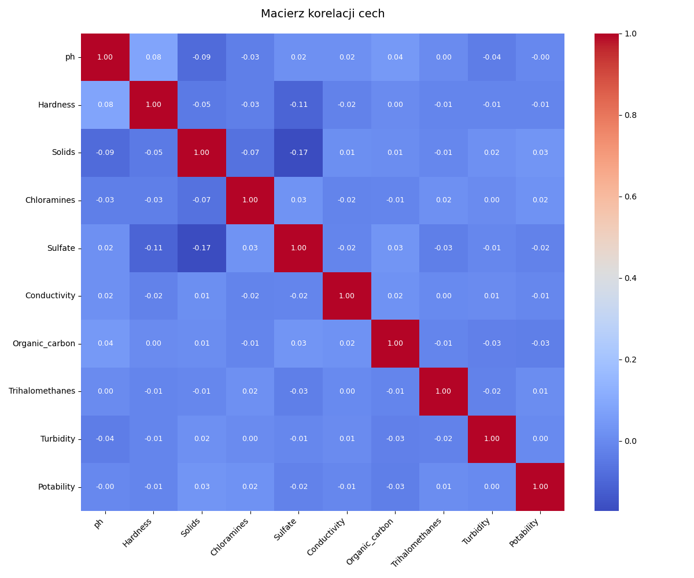
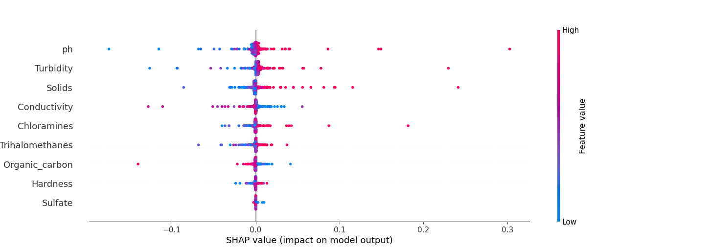
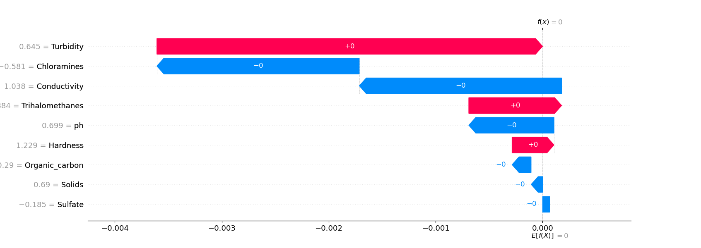
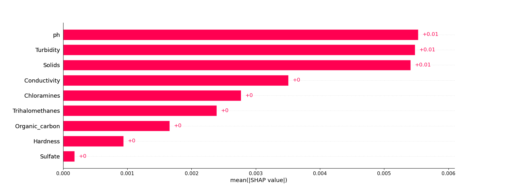

# Dane
Plik water_potability.csv zawiera wskaźniki jakości wody dla 3276 różnych zbiorników wodnych.

[Water potability](https://www.kaggle.com/datasets/adityakadiwal/water-potability/data)

Wskażniki jakości wody (cechy):
1. pH
2. Hardness (twardość)
3. Solids (Total dissolved solids - TDS)(Rozpuszczone ciała stałe TDS)
4. Chloramines (Chloraminy)
5. Sulfate (Siarczany)
6. Conductivity (Przewodność elektryczna)
7. Organic_carbon(Węgiel organiczny / TOC)
8. Trihalomethanes(Trihalometany / THM)
9. Turbidity(Mętność)
10. Potability(Zdatna do picia)

## Problem
Pytanie na które staramy się odpowiedzieć to czy woda jest zdatna do picia (potability=1) czy nie (potability=0)

## Wczytanie danych
    
        utils.read_and_describe_data()

Wczytuje dane z pliku i wypisuje ich opis:

```commandline
                ph     Hardness  ...    Turbidity   Potability
count  2785.000000  3276.000000  ...  3276.000000  3276.000000
mean      7.080795   196.369496  ...     3.966786     0.390110
std       1.594320    32.879761  ...     0.780382     0.487849
min       0.000000    47.432000  ...     1.450000     0.000000
25%       6.093092   176.850538  ...     3.439711     0.000000
50%       7.036752   196.967627  ...     3.955028     0.000000
75%       8.062066   216.667456  ...     4.500320     1.000000
max      14.000000   323.124000  ...     6.739000     1.000000

```

Pierwszy wiersz z zestawienia `count` pokazuje, że mamy braki w danych - ilość wartości w poszczególnych kolumnach nie jest taka sama.
Dodatkowo pokazuje mapę korelacji


Wartości bliskie 1 lub -1 (ciemnoczerwone lub ciemnoniebieskie):
Bardzo silny związek między cechami (jedna cecha mocno wpływa na drugą).
Wartości bliskie 0 (jasne, bladoróżowe/błękitne):
Brak jakiegokolwiek liniowego związku (cechy są od siebie całkowicie niezależne).
Brak koleracji między cechami
Wszystkie liczby na wykresie (poza przekątną, gdzie cechy łączą się same ze sobą i dają wartość 1)
wniosek: Mapa korelaci pokazuję, że między parametrami wody nie ma żadnych silnych zależności liniowych.
Wszystkie wartości współczynnika korelacji są bliskie zeru.
Co najważniejsze, żadna pojedyncza cecha nie koreluje bezpośrednio ze zmienną celu (Potability).
Podsumowanie: Model wybrany liniowy będzie ma problem z tymi danymi dlaczego? ponieważ zdatność wody
zależy od nieliniowych zalezności między wieloma parametrami.
Po kolumnie Potability widać, że Wszystkie korelacje z naszym celem są bliskie zeru
(np. dla siarczanów Sulfate to zaledwie -0.02, dla ph to -0.00).

### Analiza danych + preprocessing (usunięcie pustych wartości i duplikatów, sprawdzenie czy wszystkie dane w kolumnie są tego samego typu)

```commandline
    utils.analyse_and_clean_data(df)
```
Usuwamy wartości puste (`df.dropna()`) oraz duplikaty (`df.drop_duplicates()`)

```
    Raw set:  (3276, 10) Clean set: (2011, 10)
```

Sprawdzamy typy kolumn (cech)
```
    ph                 float64
    Hardness           float64
    Solids             float64
    Chloramines        float64
    Sulfate            float64
    Conductivity       float64
    Organic_carbon     float64
    Trihalomethanes    float64
    Turbidity          float64
    Potability           int64
```
Wszystkie kolumny są liczbami - nie mamy zmiennych kategorycznych. 
W szczególności `potability` czyli wartość, którą będziemy wyliczać, jest już liczbą.

## Feature engineering
    utils.scale_and_split()

Funkcja dzieli zbiór na treningowy i testowy. Po podziale dane mają postać 
```
X_train shape: (1608, 9) y_train shape: (1608,)
X_test shape: (403, 9) y_test shape: (403,)
```
Model będę szkolić na 1608 obserwacjach (wiersze w tabeli).
Model będę weryfikować na 403 obserwacjach (wiersze w tabeli).


## Modelowanie 
Wykorzystałam model regresji logistycznej. Wartości:
 - 0 (woda niezdatna do picia) - było przewidywane w 57%
 - 1 (woda zdatna do picia) - nie udało się przewidzieć (SKUTECZNOŚĆ MODELU 0%)

Raport klasyfikacji:
```
              precision    recall  f1-score   support
           0       0.57      1.00      0.73       231
           1       0.00      0.00      0.00       172
    accuracy                           0.57       403
   macro avg       0.29      0.50      0.36       403
weighted avg       0.33      0.57      0.42       403
```

* Precyzja (Precision): Mierzy, jaki odsetek przewidzianych wyników pozytywnych był faktycznie pozytywny.
Odpowiada na pytanie: "Jak często model ma rację, gdy przewiduje daną klasę?".

* Czułość (Recall/Sensitivity): Wskazuje, jaki odsetek rzeczywistych wyników pozytywnych został poprawnie wykryty przez model.
Odpowiada na pytanie: "Jaki procent wszystkich pozytywnych przypadków odnalazł model?".

* F1-score: Jest to średnia harmoniczna precyzji i czułości.
Stanowi balans między tymi dwoma miarami i jest szczególnie użyteczny, gdy klasy są niezrównoważone.

* Wsparcie (Support): Określa liczbę rzeczywistych wystąpień każdej klasy w zbiorze testowym.

* Dokładność (Accuracy): Ogólny odsetek poprawnych przewidywań dla wszystkich klas.

### Sumaryczna dokładność modelu 
```suma poprawnie przewidzianych (TP + TN) / ilość obserwacji zbioru testowego (X_test)```

*0.5707196029776674*

### Macierz pomyłek (Confusion matrix)

Uzyskałam macierz: 
```
[
  [230   1]
  [172   0]
]
```
Gdzie poszczególne pozycje oznaczają:
```
[
  [ TN  FP ]
  [ FN  TP ]
]
 ```
 * True-Positive (TP – prawdziwie pozytywna): przewidywanie pozytywne, faktycznie zaobserwowana klasa pozytywna
   (np. pozytywny wynik testu do picia wody i woda zdatna do picia)
 * True-Negative (TN – prawdziwie negatywna): przewidywanie negatywne, faktycznie zaobserwowana klasa negatywna
   (np. negatywny wynik testu do picia wody i woda niezdatna do picia)
 * False-Positive (FP – fałszywie pozytywna): przewidywanie pozytywne, faktycznie zaobserwowana klasa negatywna
   (np. pozytywny wynik testu do picia wody, jednak faktycznie woda niezdatna do picia)
 * False-Negative (FN – fałszywie negatywna): przewidywanie negatywne, faktycznie zaobserwowana klasa pozytywna
   (np. negatywny wynik testu do picia wody, jednak woda zdatna do picia)

 
## Optymalizacja
  

## Interpretacja wyników
Oprócz podstawowej oceny modelu (accuracy, confusion matrix, classification report), model oceniłam na podstawie wartości SHAP:

Wykres beeswarm

 * Na wykresie widać jak wartość każdej z cech wpływa na predykcję modelu. Każda kropka na wykresie przestawia jedną obserwację.
 * Im bardziej kropka jest niebieska - tym niższą wartość miałą dana cecha (np: niskie ph wody albo niska zawartość siarczanów).
 * Im bardziej kropka jest czerwona tym wyższa była wartość danej cechy (np: wysokie ph lub wysoka zawartość cząstek stałych)
 * Im bardziej kropka leży dalej od wartości 0, tym większy miała wpływ na predykcję modelu


<!--

Ten wykres przedstawia lokalną interpretację decyzji modelu dla pierwszej obserwacji. 
Model ostatecznie uznał tę wodę za niezdatną do picia, ponieważ wartość końcowa f(x) = -1.215
jest mocno ujemna.
Głównymi czynnikami, które zdecydowały o odrzuceniu tej wody (niebieskie paski), były:
 * Niski poziom siarczanów (Sulfate = -1.332) – obniżył on ocenę modelu aż o -0.54.
 * Niskie pH (ph = -1.002) – obniżyło ocenę o -0.21.

Z kolei parametry takie jak
 * twardość wody (Hardness = 1.054) 
 * przewodność (Conductivity = 1.13) 

przemawiały na korzyść zdatności wody (czerwone paski, odpowiednio $+0.12$ i $+0.09$), jednak ich pozytywny wpływ był zbyt słaby, by zrównoważyć negatywny wpływ niskiego pH i braku siarczanów.
-->



Wniosek!!!
Z wykresu widać, że m. reg. log.  opiera swoje decyzje przede wszystkim na trzech parametrach:

Odczynie pH (ph)

Mętności Turbidity

Ilości rozpuszczonych ciał stałych (Solids) 

Pozostałe cechy, takie jak siarczany czy twardość,
mają dla tego modelu znacznie mniejsze, wręcz minimalne znaczenie. Pokazuje to, że model
przy podejmowaniu decyzji kieruje się głównie najbardziej ogólnymi i podstawowymi
parametrami fizycznymi wody,
co jest charakterystyczne dla prostych klasyfikatorów liniowych.

-->

Podsumowanie końcowe:
Mój model regresji logistycznej na zbiorze water_potability osiąga dokładność na poziomie ok. 57%.
Pokazuje to, że sam zbiór parametrów  jest niewystarczający, aby precyzyjnie i bezpiecznie 
określić zdatność wody do picia w świecie rzeczywistym.

Aby taki model zastosowanie w rzeczywistości, zbiór danych musiałby zostać
rozszerzony o dodatkowe cech np.testy mikrobiologiczne (bakterie, wirusy) lub analizę stężenia
metali ciężkich, 
a sam algorytm liniowy musiałby zostać zastąpiony modelem typu Random Forest lub XGBoost.


## [Uruchomienie projektu](./RUN.md)
