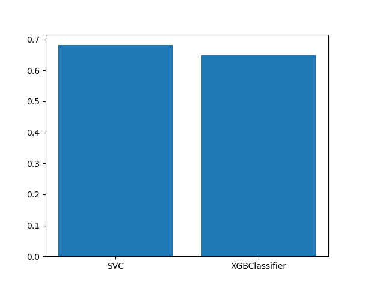
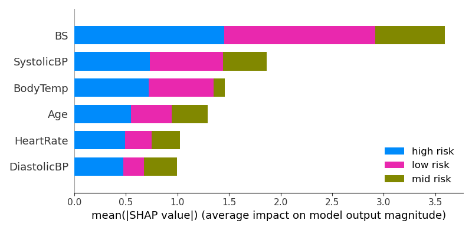
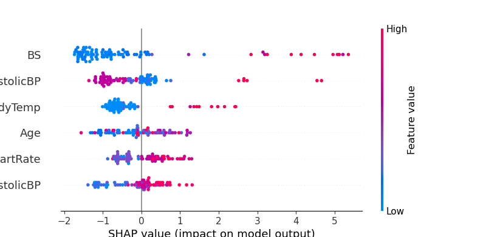

# Prereqisites

  ## Install depenencies and enable the virtual env.

  ```bash
    conda env create --file=users/pradziej/environments.yml
  ```

  ## Activate the env

  ```bash
    conda activate pr_pg26
    conda env update -f ./users/pradziej/environment.yml -n pr_pg26
  ```

  ## Prerequisites 

  If the data set isn't cached (in default datasets directory) you have to download it either from kaggle or manually (what is simpler). 
  For direct kaggle download put the API key either:
  
  - to env variable 
  ```bash
    export KAGGLE_API_TOKEN=xxxxxxxxxxxxxx
  ```

  - to file `~/.kaggle/access_token`
  - it will ask you for the token...

  ## Run

  ```bash
    python3 users/pradziej/main.py
  ```
  
## About the dataset

Data has been collected from different hospitals, community clinics, maternal health cares through the IoT based risk monitoring system.

Columns:
 - Age - age of the person [int64],
 - SystolicBP - Systolic Blood Pressure in mmHg [int64]
 - DiastolicBP - Diastolic Blood Pressure in mmHg [int64]
 - BS - Blood Sugar levels is in terms of a molar concentration, mmol/L [float64]
 - BodyTemp - Body Temperature [F] [float64],
 - HeartRate - A normal resting heart rate in beats per minute [int64].
 - RiskLevel - Predicted Risk Intensity Level during pregnancy -> OUR TARGET [str]

Source: https://www.kaggle.com/datasets/csafrit2/maternal-health-risk-data/data

It seams to be a bit ridiculous that we have few girls in age around 10 that are in pregnant (but it's possible, brutal but possible).
https://www.who.int/news-room/fact-sheets/detail/adolescent-pregnancy
https://data.unicef.org/topic/child-health/early-childbearing/

Ont the opposite there is a woman that is over 70 years old and also in pregnant, technically it's possible:
https://en.wikipedia.org/wiki/Erramatti_Mangamma

The whole dataset comes from India and from IoT sensors.

## Data loading (and cleaning)

Data are loaded directly from kaggle, based on the simple report we see that our target is of type String.

RiskLevel values are encoded as bellow:
```
RiskLevelConversionMap = {
    'low risk': 0,
    'mid risk': 1,
    'high risk': 2
}
```
Data were cleaned in standard way (drop duplicates, drop null values)
```
Amount of rows(observations), columns(features) [raw data] (1014, 7)
Amount of rows(observations), columns(features) [without duplicates data] (452, 7)
Amount of rows(observations), columns(features) [without null values] (452, 7)
```

### Correlations (spearman)
**Note:**
Although the RiskLevel is discrete, it can be treated as continuous value (probably we can imagine that between low and mid risk are some sublevels)

Pearson correlation wouldn't be a huge mistake, but spearman by the definition is better. 

#### RiskLevel to Age
```
            RiskLevel      Age
RiskLevel   1.000000  0.218472
Age         0.218472  1.000000
```
#### RiskLevel to SystolicBP
```
             RiskLevel  SystolicBP
RiskLevel     1.00000     0.31308
SystolicBP    0.31308     1.00000
```
#### RiskLevel to DiastolicBP
```
              RiskLevel  DiastolicBP
RiskLevel     1.000000   0.222473
DiastolicBP   0.222473   1.000000
```
#### RiskLevel to BS
```
            RiskLevel  BS
RiskLevel   1.000000   0.416919
BS          0.416919   1.000000
```
#### RiskLevel to BodyTemp
```
            RiskLevel  BodyTemp
RiskLevel   1.000000   0.266924
BodyTemp    0.266924   1.000000
```
#### RiskLevel to HeartRate
```
            RiskLevel  HeartRate
RiskLevel   1.000000   0.171974
HeartRate   0.171974   1.000000
```

**Note:** We see that the BloodSugar has the highest positive correlation to risk level.
Also SystolicBP and DiastolicBP seams to be important.

Finally the DataSet was divided as bellow:

```
Training Shape X: (361, 6) Testing Shape X: (91, 6)
Training Shape y: (361, 1) Testing Shape y: (91, 1)
```

Data were also scaled with StandardScaller

## Modeling

Two models were used with comparable accuracy SVC, XGBCLassifier


```
  XGB Accuracy: 64.83 %
  SVC accuracy: 68.13 %
```

## Optimalization

## Results interpretation and 
SHAP Values were used to validate model performance and accuracy


 * BloodSugar has the highest impact on the reasoning second is the Systolic Blood Pressure in all three categories.
 * Body temperature is important when the woman is categorized as high or low risk.



 * Beeswarm graph is drawn for high risk.
 * Blood Sugar (high values) and Systolic Blood Pressure are most dangerous parameters during pregnancy. It's high values impact High Risk predictions at most.
 * BodyTemp is a bit higher for most of the pregnancy women (*According to the specialist knowledge)
 * In general, the higher life parameters are the highest is the pregnancy risk (so in some manner we can treat this as a linear problem)


There were also some failures (but we don't have to check them): [link](./failures.md)